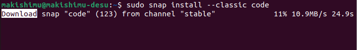
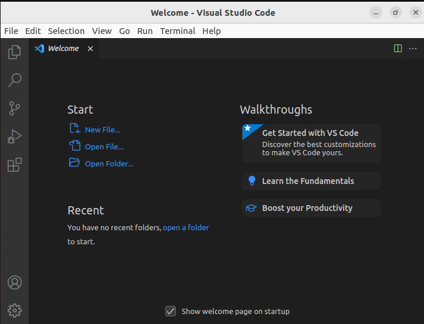

>Виконали студенти групи РПЗ-03  
>Команда 2:
>
>Кушанов Р.Г.  
>Путін М.Г.  
>Штома Д.О.

1. В ході роботи досить часто виникає необхідність встановлювати нові програми та додатки. Для цього необхідно в терміналі вміти працювати з менеджерами пакетів:

>Готував студент Путін М.Г.

  - Дайте розгорнуте визначення таким поняттям як «пакет» та «репозиторій».  
  Package and repository are concepts used in the context of managing software packages on Linux systems.
  A package is an archive that contains all the files needed to install, configure, and run a particular program. It may contain information about dependencies on other packages, program versions, documentation, etc.  
  A repository is a centralized storage of software packages that provides convenient access for users to packages from a network. Repositories usually contain packages for different distributions and their versions, and provide mechanisms for automatically updating programs.
  
  - Надайте короткий огляд існуючих менеджерів пакетів у Linux. Охарактеризуйте їх основні можливості.  
    There are several package managers in Linux, including:  
    - APT (Advanced Package Tool) is a package manager used in Debian and its derivative distributions such as Ubuntu, Linux Mint, etc. APT allows you to conveniently install, update and uninstall packages using the command line. It also provides mechanisms for automatically updating programs and their dependencies.  
    - YUM (Yellowdog Updater, Modified) is a package manager used in Red Hat-based distributions such as Fedora, CentOS, Red Hat Enterprise Linux, etc. YUM allows you to conveniently install, update, and remove packages using the command line. It also provides mechanisms for automatically updating programs and their dependencies.  
    - Pacman is a package manager used in Arch Linux distributions. Pacman allows you to conveniently install, update, and uninstall packages using the command line and has a simple and efficient dependency management mechanism. 
    - Zypper is a package manager used in SUSE Linux-based distributions such as openSUSE, SUSE Linux Enterprise, etc. Zypper allows you to conveniently install, update, and remove packages using the command line. It also provides mechanisms for automatically updating programs and their dependencies.  
    The main features of Linux package managers include:  
      - convenient installation, updating, and removal of packages using the command line;
      - automatic updating of programs and their dependencies;
      - managing dependencies between packages;
      - the ability to view information about packages installed on the system;
      - the ability to search for and install new packages from repositories;
      - the ability to create your own packages and distribute them through repositories.

2. Визначте який менеджер пакетів використовує ваш дистрибутив Linux. Опишіть основні команди для роботи з ним:

>Готував студент Штома Д.О.

  In Ubuntu and other Linux distributions that use the APT (Advanced Package Tool) package manager, you can use the following commands to perform the tasks described above:

Search for packages: 
- sudo apt search package_name

Downloading packages: 
- sudo apt download package_name

Installing packages: 
- sudo apt install package_name

Adding a new repository: 
- sudo add-apt-repository repository - sudo apt update

Viewing installed packages:
- dpkg --list

View available packages: 
- sudo apt-cache pkgnames

Remove packages: 
- sudo apt remove package_name 
- sudo apt autoremove

Update the package manager and installed packages:
-sudo apt update -sudo apt upgrade

3. Встановіть у терміналі через менеджер пакетів на свою систему:

>Готував студент Путін М.Г.

  - Новий відео- чи аудіоплейер.
     
  It succesfully installed, but i have an error on launching this program, so i don't put a screenshot of working program there.
  
  - Середовище для мови програмування, що ви вивчаєте.

  
  

4. Яким чином можна встановити нові програми через магазини додатків та менеджери пакетів у графічному середовищі. Наведіть свої приклади.

>Готував студент Кушанов Р.Г.

  
To install packages through the graphical shell, you need to open the "Ubuntu Software" application

  
Next, click on the search icon

  
And enter the name of the required application

  
By clicking on the desired application, the page of this application will be displayed, where you can install it by pressing the "Install" button

  
There is also an option through the terminal: enter the command `apt install <name>`

  
And to the question "whether to start the installation" we answer `y`
